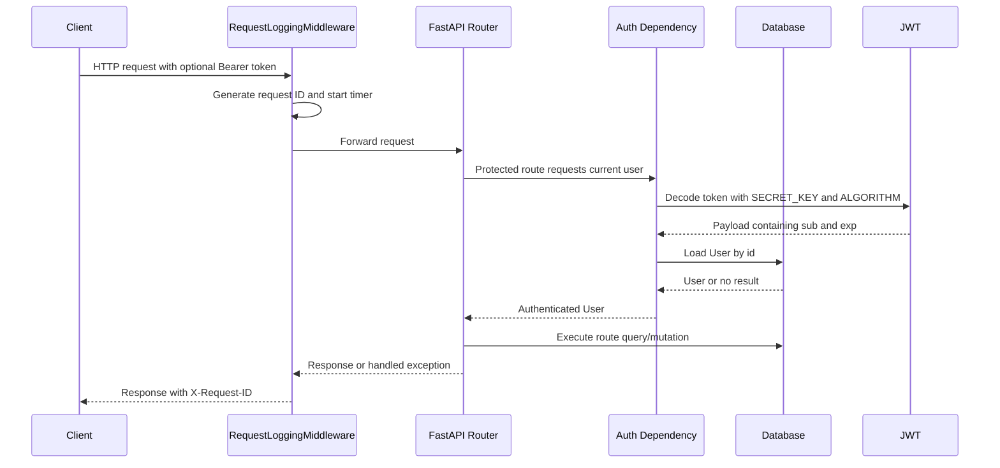
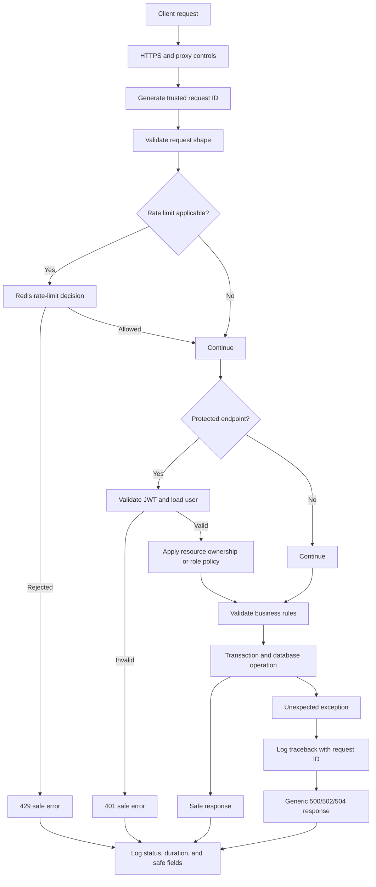

# JobTracker Authentication, Authorization, Error Handling, Logging, and Security Hardening

This document describes the security and operational design of the JobTracker API. It has two purposes:

1. Explain the behavior that exists in the current codebase.
2. Define the hardened design that should be used as the application grows.

The application is a FastAPI service using SQLAlchemy, JWT access tokens, `pwdlib` password hashing, Redis, and a relational database.

## 1. Security Objectives

The API should provide:

- Secure user registration and login.
- Short-lived, integrity-protected access tokens.
- Consistent authentication and authorization decisions.
- Strict ownership checks for user-owned applications.
- Predictable error responses that do not disclose secrets or internals.
- Request correlation through request IDs and structured logs.
- Abuse controls for login, scraping, and other expensive endpoints.
- Secure handling of configuration, database connections, Redis, CORS, and outbound URLs.
- Auditable security events without logging passwords, tokens, or private application data.

The most important rule is that authentication answers **who is calling**, while authorization answers **what that caller is allowed to do**. A valid JWT alone must never imply access to every resource.

## 2. Current Architecture

### Relevant modules

| Concern | Current location | Responsibility |
| --- | --- | --- |
| Login | `app/routers/auth.py` | Looks up a user, verifies the password, and issues a JWT |
| Password hashing | `app/security/security.py` | Hashes and verifies passwords with `PasswordHash.recommended()` |
| JWT creation | `app/security/security.py` | Adds an expiration and signs the token |
| JWT validation | `app/dependencies.py` | Decodes the token and loads the user |
| Domain exceptions | `app/exceptions.py` | Defines application-level exception types |
| HTTP exception mapping | `main.py` | Converts exceptions to JSON responses |
| Request IDs | `app/middleware/request_logging.py` | Creates `X-Request-ID` and logs request duration |
| Log formatting | `app/core/logging.py` | Adds request IDs to log records |
| Rate limiting primitive | `app/middleware/rate_limit.py` | Increments a Redis counter and raises 429 after a threshold |
| Redis connection | `app/core/redis.py` | Creates a localhost Redis client |
| Configuration | `app/config.py` | Loads settings from `.env` and environment variables |

### Current request flow



### Current authentication flow

1. The client sends form-encoded credentials to `POST /auth/login`.
2. FastAPI parses the credentials through `OAuth2PasswordRequestForm`.
3. The API queries `User` by username.
4. `verify_password` compares the supplied password with `password_hash`.
5. A failed lookup or password check raises `UnauthorizedError("Invalid username or password")`.
6. A successful login creates a JWT containing `sub`, set to the user ID, and `exp`.
7. The response is:

```json
{
  "access_token": "<jwt>",
  "token_type": "bearer"
}
```

8. The client sends the token on protected requests:

```http
Authorization: Bearer <access_token>
```

### Current token validation flow

`get_current_user` is used with `Depends(get_current_user)` on protected endpoints.

1. `OAuth2PasswordBearer` extracts the Bearer token.
2. `jwt.decode` verifies the signature and expiration using the configured secret and algorithm.
3. The `sub` claim is required and converted to an integer user ID.
4. The database is queried for that user.
5. A missing, malformed, expired, or unverifiable token returns a 401 response.
6. The loaded `User` object is passed to the route.

The current token is a stateless access token. There is no refresh-token flow, token revocation list, session table, or logout invalidation.

## 3. Authentication Design

### Password storage

Passwords must never be stored or logged in plaintext. The current implementation uses `pwdlib` and its recommended password hashing configuration, which is the right abstraction for password storage.

Registration currently follows this flow:

1. `POST /users/register` receives `UserCreate` data.
2. The API checks whether the username or email already exists.
3. The password is hashed with `hash_password`.
4. Only the resulting hash is stored in `users.password_hash`.
5. The API returns `UserResponse`, which must not expose `password_hash`.

Required rules:

- Enforce a minimum password length in the schema.
- Prefer a password strength policy based on length rather than brittle character rules.
- Normalize email addresses consistently before uniqueness checks.
- Never reveal whether a username or email exists during sensitive account recovery flows.
- Consider `password_hash` a secret even though it is not the original password.
- Keep password hashing cost high enough for production, but measure login latency under expected load.
- Plan a rehash-on-login path when the hashing library reports that an old hash should be upgraded.

### Login protection

Login is a high-value abuse target. It should have:

- A Redis-backed rate limit keyed by a combination of normalized username and client IP.
- A broader IP limit to prevent username rotation.
- A generic failed-login response.
- Security-event logging without the password or token.
- Optional temporary account throttling after repeated failures, with care to avoid denial of service against a victim account.

The current `check_rate_limit` helper is not currently attached to the login route. That wiring is required before it provides protection.

### JWT design

The current token contains `sub` and `exp`. The hardened token should also use explicit, validated claims where needed:

- `sub`: stable user identifier.
- `iat`: issue time.
- `exp`: short expiration time.
- `jti`: unique token identifier if revocation or audit tracking is required.
- `iss`: expected issuer.
- `aud`: expected audience.
- `type`: `access` for access tokens.

Recommended policy:

- Use a short access-token lifetime, commonly 15 to 60 minutes depending on the client.
- Keep refresh tokens separate from access tokens and rotate them on use.
- Store refresh-token hashes server-side if revocation is required.
- Validate issuer, audience, token type, and required claims.
- Allow only a fixed, explicitly supported algorithm. Do not accept an algorithm supplied by the token.
- Use a strong secret from a secret manager or environment variable, never a committed file.
- Rotate signing keys with a key identifier (`kid`) when the deployment requires key rotation.
- Reject tokens with a missing or invalid subject instead of coercing unexpected data.

### Authentication failure behavior

All authentication failures should look similar to callers:

```json
{
  "detail": "Could not validate credentials"
}
```

Do not distinguish in public responses between:

- Unknown user.
- Wrong password.
- Expired token.
- Invalid signature.
- Missing user record.

Detailed reasons may be written to a security log with controlled fields, but should not become an account-enumeration oracle.

## 4. Authorization Design

### Current authorization model

The current application uses two levels of protection:

1. Public read or onboarding endpoints, such as registration and general job/company reads.
2. Authenticated endpoints using `get_current_user`.

Application ownership is enforced directly in SQL queries. For example, application lookup, update, and delete filter by both:

- `Application.id == application_id`
- `Application.user_id == current_user.id`

This is the correct shape for preventing an authenticated user from accessing another user's application. The same ownership constraint is used when listing the current user's applications and jobs/companies associated with those applications.

### Authorization matrix

| Endpoint area | Authentication | Current authorization rule |
| --- | --- | --- |
| `POST /auth/login` | No | Credentials must be valid |
| `POST /users/register` | No | Username and email must be unique |
| `GET /users/me` | Yes | Caller may read their own user record |
| `GET /jobs` | No | Public list |
| `GET /jobs/{job_id}` | No | Public read if the job exists |
| `GET /jobs/my` | Yes | Jobs connected to caller's applications |
| `GET /companies` | No | Public list |
| `GET /companies/{company_id}` | No | Public read if the company exists |
| `GET /companies/my` | Yes | Companies connected to caller's applications |
| `/applications/*` | Yes | Caller may operate only on their own applications |

### Authorization rules for every protected resource

For any endpoint that accepts a resource ID:

1. Authenticate the caller.
2. Query the resource with the caller ownership condition in the same database query.
3. Return a uniform 404 when the resource is absent or belongs to another user.
4. Do not load an unrestricted resource first and check ownership later unless there is a strong reason.
5. Apply the same ownership rule to reads, updates, deletes, and nested resources.
6. Enforce ownership in service functions as well when those functions can be called from more than one route.
7. Do not trust a user ID from request JSON, query parameters, or path data when it can be derived from the authenticated principal.

The uniform 404 behavior reduces resource enumeration. A caller should not be told that an ID exists but belongs to someone else.

### Roles and permissions

There is currently no role column or permission model. If administrative features are added, introduce an explicit authorization layer rather than scattering checks across routes. A small policy dependency can express the intended decision:

```python
def require_admin(current_user: User = Depends(get_current_user)) -> User:
    if current_user.role != "admin":
        raise ForbiddenError("Insufficient permissions")
    return current_user
```

Use 401 when the caller is not authenticated and 403 when the caller is authenticated but lacks permission. Add a `ForbiddenError` type if role-based features are introduced.

## 5. Error Handling Design

### Current exception flow

The application defines `AppException` and specialized exceptions:

- `NotFoundError` -> 404
- `ConflictError` -> 409
- `BadRequestError` -> 400
- `UnauthorizedError` -> 401
- Other `AppException` -> 500
- FastAPI `HTTPException` -> its supplied status code

Handlers return a simple response such as:

```json
{
  "detail": "Application not found"
}
```

This is a useful foundation because route code can express domain failures without repeating `JSONResponse` construction.

### Required error categories

The API should consistently use:

| Status | Meaning | Example |
| --- | --- | --- |
| 400 | Request is syntactically valid but business data is invalid | Unsupported application status |
| 401 | Authentication is missing or invalid | Missing or expired Bearer token |
| 403 | Authenticated caller lacks permission | Non-admin accesses admin endpoint |
| 404 | Resource is absent or intentionally hidden | Other user's application |
| 409 | Operation conflicts with current state | Duplicate user or application |
| 422 | FastAPI/Pydantic validation failure | Invalid request field type |
| 429 | Rate limit exceeded | Too many login attempts |
| 500 | Unexpected server failure | Unhandled database or service error |
| 502/504 | Upstream scraper or dependency failure | Job site unavailable or timed out |

### Do not leak internal exception details

The current scraper endpoint converts every exception into a `BadRequestError` containing `str(e)`. That can disclose URLs, library details, internal paths, response data, or infrastructure information. It can also misclassify a server or upstream failure as a client error.

Recommended behavior:

- Return a stable public message such as `Could not scrape the job page`.
- Log the original exception server-side with the request ID and safe context.
- Map invalid user input to 400.
- Map an unreachable or failing upstream site to 502 or 504.
- Preserve the original exception with exception chaining for logs and debugging.
- Never return stack traces, SQL statements, tokens, passwords, secret values, or raw upstream response bodies.

### Error response shape

For a larger API, standardize errors so clients can handle them reliably:

```json
{
  "error": {
    "code": "application_not_found",
    "message": "Application not found",
    "request_id": "8b4a2d8b-3bb4-4bd7-9f1e-1d7d2f5d3d44"
  }
}
```

Keep `message` safe for end users. Keep internal diagnostics in logs. Including the request ID lets support staff correlate a client report with server-side records.

### Exception safety

Database mutations should use a rollback path:

```python
try:
    db.commit()
except IntegrityError:
    db.rollback()
    raise ConflictError("The application already exists")
```

The database session dependency should also close sessions reliably. Unexpected exceptions should be logged once at the application boundary, with the exception traceback attached to the log record, then return a generic 500 response.

## 6. Logging and Observability

### Current request logging flow

`RequestLoggingMiddleware` currently:

1. Generates a UUID request ID.
2. Stores it on `request.state.request_id`.
3. Places it in the `request_id_context` context variable.
4. Measures request duration.
5. Logs method, path, status, and duration.
6. Adds `X-Request-ID` to the response.

`RequestIDFormatter` adds the request ID to log records created while the context variable is active.

Example current log format:

```text
[2026-09-17 10:15:00,123] [INFO] [app.middleware.request_logging] [request_id=...] GET /users/me | status=200 | duration=12.34ms
```

### Logging levels

Use levels consistently:

- `DEBUG`: local diagnostics; normally disabled in production.
- `INFO`: normal request completion, startup, shutdown, migrations, and important state changes.
- `WARNING`: rejected rate limits, suspicious input, upstream degradation, or recoverable misconfiguration.
- `ERROR`: failed operations that need investigation.
- `CRITICAL`: process-wide failures or security incidents requiring immediate action.

### What to log

For each request, capture structured fields where possible:

- `request_id`
- HTTP method
- normalized route template, not only the raw path
- status code
- duration in milliseconds
- authenticated user ID when available
- client address or a privacy-approved representation
- user agent when useful
- exception category for failures

For security events, capture:

- event name, such as `login_failure` or `token_rejected`
- request ID
- user ID if known, otherwise normalized username hash or safe identifier
- reason category, not secret values
- source address subject to privacy policy
- timestamp

### What must never be logged

Never log:

- Passwords.
- Authorization headers or complete JWTs.
- Refresh tokens or API keys.
- `SECRET_KEY`.
- Database URLs containing credentials.
- Full private application notes unless explicitly approved.
- Raw upstream pages or request bodies by default.
- Session cookies.

Use redaction at the logging boundary as defense in depth. Log event names and identifiers rather than entire request payloads.

### Middleware robustness

The request middleware should use `try/finally` so duration logging and context cleanup happen even when `call_next` raises. The context variable should be reset using the token returned by `request_id_context.set(...)`; otherwise request IDs can leak across asynchronous work in long-lived workers.

The response request ID should be preserved if a trusted upstream already supplied one only when the deployment explicitly supports trusted proxy correlation. Otherwise generate the ID at the application boundary and do not trust client-supplied IDs.

### Metrics and alerts

Add metrics for:

- Request count by route and status class.
- Request latency percentiles.
- Login successes and failures.
- 401, 403, 409, and 429 rates.
- Scraper success, timeout, and upstream error counts.
- Database and Redis errors.
- Unexpected 500 responses.

Alert on sudden increases in failed logins, 401/403 responses, 429 responses, 500 responses, scraper failures, or latency.

## 7. Rate Limiting and Abuse Controls

The current Redis helper uses `INCR`, sets an expiry for the first request, and raises 429 when the count exceeds the limit. It is a fixed-window counter.

### Required integration points

Apply rate limits at minimum to:

- `POST /auth/login`: strict per-IP and per-username limits.
- `POST /users/register`: per-IP limit.
- `POST /applications/url/preview`: strict limit because it performs outbound work.
- Any future password reset or email verification endpoint.
- Any administrative or bulk endpoint.

### Implementation concerns

- Include a namespace in every Redis key, such as `rate:login:ip:<value>`.
- Use a trusted client-IP strategy when behind a proxy; do not blindly trust `X-Forwarded-For`.
- Fail closed or fail open deliberately when Redis is unavailable. Login and expensive scraping endpoints usually need an explicit degraded-mode policy.
- Return `Retry-After` with 429 responses when the retry time is known.
- Consider a sliding-window or token-bucket algorithm for smoother behavior.
- Make limits configurable through environment settings.
- Do not put raw email addresses or other sensitive identifiers directly into logs or long-lived keys without a privacy decision.

## 8. Security Hardening Checklist

### Configuration and secrets

- Require `SECRET_KEY`, `DATABASE_URL`, and algorithm settings at startup.
- Validate that production secrets are not default, empty, or too short.
- Use a secret manager in production.
- Do not commit `.env` files or credentials.
- Keep separate secrets and databases per environment.
- Use an explicit allowlist for supported JWT algorithms.
- Add settings for token lifetime, Redis URL, CORS origins, trusted proxy behavior, and rate limits.
- Avoid logging settings objects because they may contain secrets.

### Transport and browser controls

- Serve production traffic over HTTPS only.
- Configure HSTS at the TLS-terminating proxy after HTTPS is confirmed everywhere.
- Keep CORS origins explicit. The current `allow_origins=["http://localhost:3000"]` is suitable only for that local frontend.
- Avoid `allow_methods=["*"]` and `allow_headers=["*"]` in production; enumerate what the client needs.
- Set appropriate security headers at the proxy or application boundary: `X-Content-Type-Options`, `Content-Security-Policy` where applicable, `Referrer-Policy`, and `Permissions-Policy`.
- If browser cookies are introduced, use `Secure`, `HttpOnly`, and an intentional `SameSite` policy, plus CSRF protection for cookie-authenticated state changes.

### Database

- Use a least-privileged database account.
- Encrypt database connections where supported.
- Keep migrations reviewed and reproducible.
- Add indexes for ownership and lookup columns used by authorization queries.
- Use transactions for multi-step application creation and update flows.
- Roll back after failed commits before reusing a session.
- Do not expose raw SQL errors to clients.

### Outbound scraping

The URL scraping feature is a security-sensitive server-side request feature.

- Permit only `http` and `https` URLs.
- Block localhost, loopback, link-local, private, and metadata IP ranges after DNS resolution.
- Re-check redirects so a public URL cannot redirect into an internal network.
- Set connection, read, total, and response-size limits.
- Use an allowlist of supported job boards when practical.
- Do not allow arbitrary ports unless required.
- Sanitize and validate extracted fields before persistence.
- Do not execute downloaded content.
- Rate-limit scraping and record safe upstream host information for operations.

### Dependencies and deployment

- Pin and regularly update dependencies.
- Run vulnerability scanning in CI.
- Run the service as a non-root user.
- Keep Redis and the database off the public network.
- Use network policies or firewall rules between services.
- Add health checks that do not disclose credentials or internal topology.
- Keep backups encrypted and test restoration.
- Define log retention and access controls.

## 9. Recommended Request Lifecycle



## 10. Testing Strategy

Security behavior should be tested as behavior, not only as implementation details.

### Authentication tests

- Register a user and verify the password hash is not returned.
- Login with valid credentials.
- Reject an unknown username.
- Reject an incorrect password.
- Reject a missing Bearer token.
- Reject a malformed token.
- Reject a token with an invalid signature.
- Reject an expired token.
- Reject a token with a missing or invalid `sub` claim.
- Reject a valid token for a deleted user.

### Authorization tests

- A user can read their own profile.
- A user can list only their own applications.
- A user cannot read, update, or delete another user's application by changing the path ID.
- A user cannot use a request-body user ID to act as another user.
- A non-admin cannot access future admin routes.
- Ownership failures return the intended uniform 404.

### Error and operational tests

- Domain exceptions map to their documented status codes.
- Validation errors have a stable shape.
- Unexpected exceptions return a generic response and do not disclose details.
- Failed commits roll back the session.
- Every response contains a request ID when request middleware is active.
- Request IDs appear in logs for successful and failed requests.
- Request context is cleared after a request.
- Rate-limited responses return 429 and `Retry-After` when available.
- Redis failure follows the documented degraded-mode policy.
- Scraper timeout, redirect, private-IP, and oversized-response cases are rejected.

### Example manual checks

```powershell
# Start the API in the project virtual environment.
python -m uvicorn main:app --reload

# Run the existing tests.
python -m pytest
```

Use a dedicated test database and test Redis instance. Do not run destructive tests against production services.

## 11. Implementation Priorities

### Priority 1: close immediate exposure

1. Wire rate limiting into login, registration, and URL preview.
2. Stop returning raw scraper exception text to clients.
3. Add a generic unexpected-exception handler that logs tracebacks and returns a safe 500.
4. Add `ForbiddenError` and use it for future permission failures.
5. Add tests for cross-user application access.
6. Ensure request context cleanup and error-path logging.

### Priority 2: strengthen identity and configuration

1. Validate JWT algorithm and production secret strength.
2. Add issuer, audience, issue time, and token type claims where appropriate.
3. Add configurable Redis and CORS settings.
4. Add security-event logs for login and token failures.
5. Standardize error response shape and include request IDs.

### Priority 3: production hardening

1. Add refresh-token rotation and revocation if long-lived sessions are needed.
2. Add role/policy dependencies for administrative features.
3. Harden outbound scraping against SSRF and resource exhaustion.
4. Add metrics, alerts, dependency scanning, encrypted transport, and least-privilege deployment.
5. Perform a threat model and an external security review before handling sensitive production data.

## 12. Definition of Done

The security and operations design is complete when:

- Every protected route has an explicit authentication and authorization rule.
- Every resource-ID route performs ownership checks in its query or service policy.
- Authentication and authorization failures are indistinguishable where enumeration is a risk.
- No endpoint returns credentials, tokens, stack traces, SQL, or raw upstream errors.
- Login and expensive endpoints are rate-limited.
- Request IDs connect client errors, logs, and metrics.
- Unexpected failures are logged with tracebacks and returned as safe generic responses.
- JWT settings and secrets are validated at startup.
- SSRF protections cover DNS, redirects, private addresses, ports, and response limits.
- Automated tests cover token failures, cross-user access, rate limits, and error contracts.
